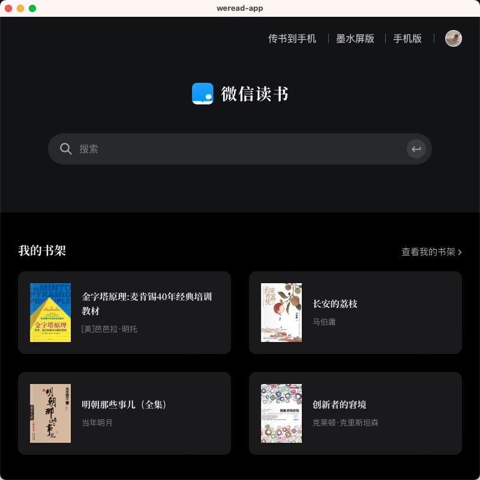

# weread-app

## 概述

weread-app 是一个基于 Tauri 框架开发的应用程序，旨在提供一个集成了微信读书的功能的本地应用体验。通过内嵌微信读书的 Web 页面，用户可以方便地访问和阅读微信读书的内容。同时，weread-app 还提供了菜单功能，以支持页面导航和自定义窗口大小，以便用户能够根据自己的需求进行阅读和操作。  
  
  
## 下载地址
https://github.com/jiangfei5945/weread-app/blob/main/src-tauri/target/release/bundle/dmg/weread-app_1.0.1_x64.dmg

## 使用指南
界面  
  
菜单  

## 联系方式

如果您有任何问题、反馈或建议，可以通过以下方式联系我们：

- 电子邮件：[jiangfei5945@gmail.com](mailto:jiangfei5945@gmail.com)
